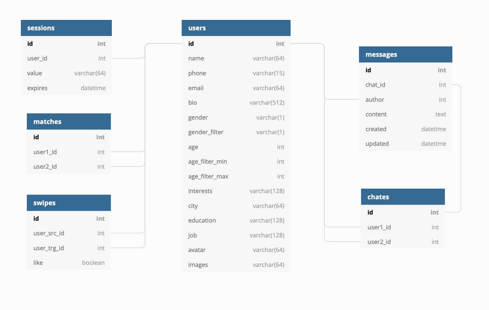

# Tinder-HighLoad

## Описание сервиса

### Сервис для знакомств

* 66 млн активных пользователей
* 1.6 млрд свайпов в день
* 12 млн совпадений в день
* Целевая аудитория находится в Северной Америке и Европе

### MVP
* Проофиль пользователя
* Лента рекомендаций
* Система лайков (matches)
* Чаты совместимых пользователей

## Расчет нагрузки

### Статистика

Примерное количество пользователей, находящихся в Северной Америке и Европе, составляет 50% от общего количества активных пользователей. Далее перевдены значения в соответсвии с этим распределнием.

|Значение|Параметр|
| :-------------:  | -------------  |
|80 млн|Количество зарегестрированных пользователей|
|33 млн |[ Количество активных пользователей в месяц](https://www.reuters.com/article/us-match-group-results-idUSKBN2A22V1)|
|12 млн (~37%)|[ Количество пользователей, пользующихся сервисом ежедневно](https://www.businessofapps.com/data/tinder-statistics/)|
|16 млн (~50%)|[ Количество пользователей в пиковое время (21:00)](https://www.huffingtonpost.co.uk/entry/how-to-get-tinder-matches_n_56a78f4be4b0172c659422da)|
|25 минут|[ Среднее время использования сервиса в день](https://ogury.com/perspectives/research-and-insights/dater-analysis-the-habits-of-dating-app-users-around-the-world/)|
|0.8 млрд|[ Количество свайпов в день](https://www.businessofapps.com/data/tinder-statistics/)|
|1.5 млрд |[Пиковое количество свайпов за день](https://www.bbc.com/news/business-52743454)|
|6 млн|[ Количество совпадений в день](https://www.businessofapps.com/data/tinder-statistics/)|
|9.92|[ Среднее количество просматриваемых страниц](https://www.similarweb.com/website/tinder.com/)|
|10 минут|[ Среднее время использования сервиса за 1 посещение](https://www.similarweb.com/website/tinder.com/)|

При 80 млн зарегистрированных пользователей предположим, что 30% пользователей когда-либо начинали общение в чате. В среднем на человека проиходится 5 чатов, по 10 сообщений.

	80 млн * 0.3 * 5 = 120 млн чатов
	
	120 млн * 10 = 1200 млн сообщений

### Нагрузка

##### Использования сайта 1 пользователем за 1 минуту:
	
	Статика - 1 МБ; 128 запросов
	
	Динамика - 650 КБ; 63 запроса
	
	Изображения - 4 МБ; 92 запроса

##### Использования сайта 1 пользователем за 1 день:

При среднем времени использования сервиса в день равным 25 минутам:

	Статика - 1 МБ * 25 = 25 МБ; 128 * 25 = 3200 запросов
	
	Динамика - 650 КБ * 25 ≈ 16 МБ; 63 * 25 = 1575 запросов
	
	Изображения - 4 МБ * 25 = 100 МБ; 92 * 25 = 2300 запросов

##### Использования сайта за 1 день:

При количеcтве пользователей, ежедневно пользующиеся сервисом, равным 12 млн:

	Статика - 25 МБ * 12e6 = 300e6 МБ; 3200 * 12e6 = 38.4e9 запросов
	
	Динамика - 16 МБ * 12e6 = 192e6 МБ; 1575 * 12e6 = 18.9e9 запросов
	
	Изображения - 100 МБ * 12e6 = 1200e6 МБ; 2300 * 12e6 = 27.6e9 запросов

##### Трафик:

	Статика - 300e6 МБ / (24 * 60 * 60) ≈ 27 Гб/с
	
	Динамика - 192e6 МБ / (24 * 60 * 60) ≈ 17 Гб/с
	
	Изображения - 1200e6 МБ / (24 * 60 * 60) ≈ 109 Гб/с
 
##### RPS:

	Статика 38.4e9 / (24 * 60 * 60) ≈ 444e3 RPS
	
	Динамика 18.9e9 / (24 * 60 * 60) ≈ 218e3 RPS
	
	Изображения 27.6e9 / (24 * 60 * 60) = 319e3 RPS

## Логическая схема БД

