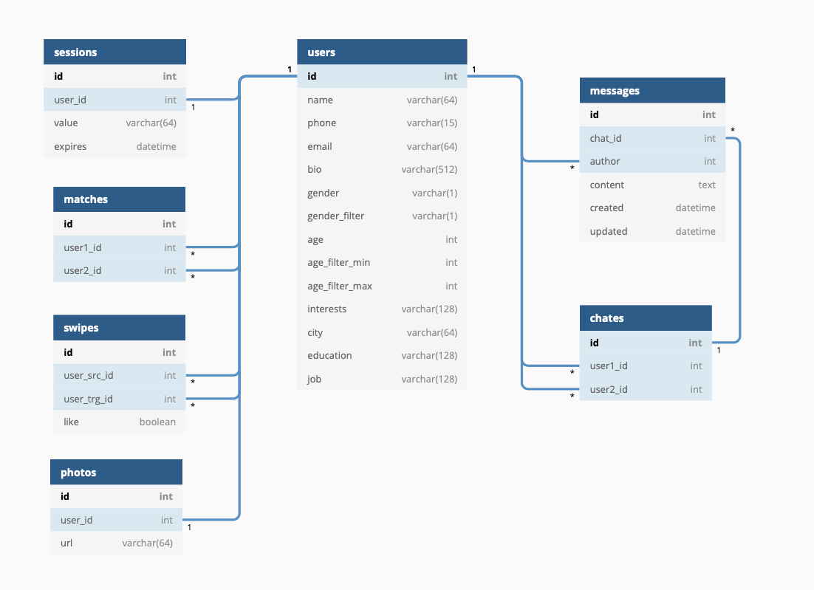
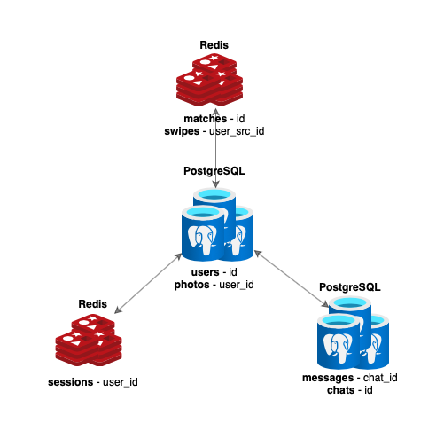

# Tinder-HighLoad

## Описание сервиса

### Сервис для знакомств

* 66 млн активных пользователей
* 1.6 млрд свайпов в день
* 12 млн совпадений в день
* Целевая аудитория находится в Северной Америке и Европе

### MVP
* Профиль пользователя
* Лента рекомендаций
* Система лайков (matches)
* Чаты совместимых пользователей

## Расчет нагрузки

### Статистика

Примерное количество пользователей, находящихся в Северной Америке и Европе, составляет 50% от общего количества активных пользователей. Далее перевдены значения в соответсвии с этим распределнием.

|Значение|Параметр|
| :-------------:  | -------------  |
|80 млн|Количество зарегестрированных пользователей|
|33 млн |[ Количество активных пользователей в месяц](https://www.reuters.com/article/us-match-group-results-idUSKBN2A22V1)|
|12 млн (~37%)|[ Количество пользователей, пользующихся сервисом ежедневно](https://www.businessofapps.com/data/tinder-statistics/)|
|6 млн (~50%)|[ Количество пользователей в пиковое время (21:00)](https://www.huffingtonpost.co.uk/entry/how-to-get-tinder-matches_n_56a78f4be4b0172c659422da)|
|25 минут|[ Среднее время использования сервиса в день](https://ogury.com/perspectives/research-and-insights/dater-analysis-the-habits-of-dating-app-users-around-the-world/)|
|0.4 млрд|[ Количество свайпов в день](https://www.businessofapps.com/data/tinder-statistics/)|
|0.75 млрд |[Пиковое количество свайпов за день](https://www.bbc.com/news/business-52743454)|
|3 млн|[ Количество мэтчей в день](https://www.businessofapps.com/data/tinder-statistics/)|
|9.92|[ Среднее количество просматриваемых страниц](https://www.similarweb.com/website/tinder.com/)|
|10 минут|[ Среднее время использования сервиса за 1 посещение](https://www.similarweb.com/website/tinder.com/)|

Предполложим, что 70% совместимых пользователей начинают общение в чате и пишут в среднем по 20 сообщений:

	3 млн * 0.7 = 2.1 млн чатов/д
	2.1 млн * 20 = 42 млн сообщений/д

Также предположим, что за день:

* для прочтения новых сообщений в чат заходят в среденем 5 раз;
* информацию в своем профиле изменяет 0.5% активных пользователей (60 тыс.);
* регистрируется 100 тыс. новых пользователей.

### Сетевой трафик

При использовании сайта воспроизводилась прокрутка ленты и общение в чате.

	Использование сайта 1 пользователем за 1 минуту:
	
	Статика - 1 МБ; Динамика - 650 КБ; Изображения - 4 МБ.

#### Суточный трафик

При среднем времени использования сервиса в день равным 25 минутам и количеcтве пользователей, ежедневно пользующиеся сервисом, равным 12 млн:

	Статика - 1 МБ * 25 * 12e6 ≈ 293000 Гбайт/сутки
	
	Динамика - 650 КБ * 25 * 12e6 ≈ 186000 Гбайт/сутки
	
	Изображения - 4 МБ * 25 * 12e6 ≈ 1172000 Гбайт/сутки

#### Пиковое потребелние

В пиковое время (21:00) количество пользователей составляет 6 млн.

	Статика - 1 МБ * 6e6 / 60 ≈ 781 Гбит/сек
	
	Динамика - 650 КБ * 6e6 / 60 ≈ 496 Гбит/сек
	
	Изображения - 4 МБ * 6e6 / 60 ≈ 3125 Гбит/сек

### RPS по типам запросов

#### Профили

	Запросы на создание и изменение профиля:
	
	(100e3 + 60e3) / (24 * 60 * 60) ≈ 2 RPS

	Профиль пользователя должен подгружаться при каждом свайпе:

	400e6 / (24 * 60 * 60) ≈ 4630 RPS

#### Свайпы

	Запросы на запись:

	400e6 / (24 * 60 * 60) ≈ 4630 RPS

#### Мэтчи

	Запросы на запись:

	3e6 / (24 * 60 * 60) ≈ 35 RPS

	Получать список мэтчей необходимо один раз за один заход пользователя.
	Поэтому запросы на получение, исходя из 12 млн активной аудитории:

	12e6 / (24 * 60 * 60) ≈ 139 RPS

#### Рекомендации

При очередном свайпе необходимо выдать следующего рекомендованного человека. Рекомендательная система будет основана на свайпах и профилях. Сервис рекомендаций будет выдавать по несколько рекомендуемых людей за раз, чтобы заранее высчитывать рекомендации. Выдавать будет по 4 профиля, чтобы рекомендации были актуальны.

	Запросы на получение:

	400e6 / 4 / (24 * 60 * 60) ≈ 1157 RPS

#### Чаты

	Запросы на запись:

	2.1e6 / (24 * 60 * 60) ≈ 24 RPS

	Получать список чатов также необходимо один раз за один заход пользователя.
	Поэтому запросы на получение:

	12e6 / (24 * 60 * 60) ≈ 139 RPS

#### Сообщения

	Запросы на запись:

	42e6 / (24 * 60 * 60) ≈ 486 RPS

	Запросы на получение, исходя из среднего количества заходов в чаты:

	12e6 * 5 / (24 * 60 * 60) ≈ 694 RPS

#### Фотографии

	Фотографии подгружаются при каждом свайпе.
	С учетом среднего количества фото у пользователя равного 3:

	400e6 * 3 / (24 * 60 * 60) ≈ 13889 RPS

#### Итоговая таблица

|Сущность|RPS|
| -------------  | :-------------:  |
|Профили пользователей|4632|
|Свайпы|4630|
|Мэтчи|174|
|Рекомендации|1157|
|Чаты|163|
|Сообщения|1180|
|Фотографии|13889|

## Логическая схема БД

При прокрутки ленты свайпы сохраняются в таблицу swipes. Если находятся обоюдные свайпы с like=true, то данные о пользователях добавляются в таблицу matches. При этом мэтчи не исчезают с течением времени.

## Физическая схема БД

### Хранение фотографий

При добавлении новой фотографии в файловой системе сервера будет создаваться директория c именем, содержащим уникальный сгенерированный хеш. В этой директории будет хранится переданное изображение в оригинальном и измененных размерах (640x800, 320x400, 172x216, 84x106)

Имена файлов изображений также будут содержать единый сгенерированный хеш, к именам изображений в измененных размерах будет добавляться приставка с информацией о размере (например 640x800_). Путь до файла с оригинальным переданным изображением будет сохранятся в поле url таблицы photos. Файлы с измененнымы размерами можно будет получить, добавив приставку необходимого размера в начало url-а.

### Выбор СУБД

Данные пользователей, информацию о фотографиях, чаты и сообщения будем хранить в PostgreSQL, как в наиболее надежной и функциональной реляционной БД.

Данные сессии, свайпы и мэтчи будем хранить в Redis из-за его выскокой скорости работы. Также Redis поддерживает неблокирующую master-slave репликацию.

### Шардирование и репликация

Профили пользователей, чаты и мэтчи будем шардировать по id. Сообщения по chat\_id. Свайпы по тому пользователю, который свайпнул, то есть по user\_src\_id. Сессии и информацию о фотографиях по user\_id.

Фотографии будем шардировать по url-у, т.е. по имени диретории, в которой хранятся изображения.

Для обеспечения отказоустойчивости используем master-slave репликацию. По 2 реплики на каждый сервер. Мастер будет принимать запросы на запись, реплики - на чтение. При выходе из строя мастера, одна из реплик возмет на себя запросы на изменение. При выходе из строя всех реплик, запросы будут приходить только на мастер.

### Схема с привязкой к конкретным БД и указанием схемы шардинга

### Размер данных

#### Фотографии

В среднем у пользователя в профиле находится 3 фотографии. Ограничим размер оригинального изображения до 1МБ. Остальные изображения ограничим следующими размерами:

|Соотношение|Размер|
| -------------  | :-------------:  |
| 640x800 |100 КБ|
| 320x400 |40 КБ|
| 172x216 |15 КБ|
| 84x106 |5 КБ|
	
	Примерный вес всех фотографий:

	(1 МБ + 100 КБ + 40 КБ + 15 КБ + 5 КБ) * 80e6 * 3 = 277.5e6 МБ ≈ 265 ТБ

#### Профили пользователей

	Размер таблицы для 1 пользователя:

	8 + 64 + 15 + 64 + 512 + 1 + 1 + 8 + 8 + 8 + 128 + 64 + 128 + 128 = 1197 Б

	Исходя из статистики в 80 млн зарегестрированных пользователей:

	1197 Б * 80e6 = 100.88e9 Б ≈ 89 ГБ

#### Информация о фотографиях

	Размер таблицы для 1 фотографии:

	8 + 8 + 64 = 80 Б

	Исходя из статистики в 80 млн зарегестрированных пользователей:

	80 Б * 80e6 = 6.4e9 Б ≈ 6 ГБ

#### Сессии пользователей

	Размер таблицы для 1 сессии:

	8 + 8 + 64 + 8 = 88 Б

	С учетом 33 млн активных пользователей:

	88 Б * 33e6 = 7040e6 Б ≈ 0.3 ГБ

#### Свайпы

	Размер таблицы для 1 свайпа:

	8 + 8 + 8 + 1 = 25 Б

	С учетом 0.4 млрд свайпов в день:

	25 Б * 0.4e9 * 30 = 10e9 Б * 30 ≈ 279 ГБ/мес

#### Мэтчи

	Размер таблицы для 1 мэтча:

	8 + 8 + 8 = 24 Б

	С учетом 3 млн мэтчей в день:

	24 Б * 3e6 * 30 = 72e6 Б * 30 ≈ 2.1 ГБ/мес

#### Чаты

	Размер таблицы для 1 чата:

	8 + 8 + 8 = 24 Б

	С учетом 2.1 млн чатов в день:

	24 Б * 2.1e6 * 30 = 50.4e6 Б * 30 ≈ 1.2 ГБ/мес

#### Сообщения

Примем среднюю длину сообщения равную 30 Б.

	Размер таблицы для 1 сообщения:

	8 + 8 + 8 + 30 + 8 + 8 = 70 Б

	С учетом 42 млн сообщений в день:

	70 Б * 42e6 * 30 = 2940e6 Б * 30 ≈ 81 ГБ/мес

### Итоговая таблица

|Сущность|СУБД|Шардинг|Размер|Объем*|Количество|
| -------------  |  :-------------:  | :-------------:  | :-------------:  | :-------------:  | :-------------:  |
|Профили пользователей|PostgresSQL|id|94 ГБ|80 млн|4|
|Информация о фотографиях| PostgresSQL |user\_id|6 ГБ|240 млн|8|
|Сессии пользователей|Redis|user\_id|0.3 ГБ|33 млн|2|
|Свайпы|Redis|user\_src\_id|279 ГБ / мес|12 млрд / мес|120 шт / мес|
|Мэтчи|Redis|id|2.1 ГБ / мес|90 млн / мес |3 шт / мес|
|Сообщения|PostgresSQL|chat\_id|81 ГБ / мес|1.260 млрд / мес|16 шт / мес|
|Чаты|PostgresSQL|id|1.2 ГБ / мес|63 млн / мес|2 шт / мес|
|Фотографии|Файловая система|url|265 ТБ|240 млн|17|

Объем* - общее количество записей.

### Оборудование

|Сущность|CPU (ядра)|RAM (ГБ)|SSD (ГБ)|Количество   (masters+slaves)|
| -------------  | :-------------:  | :-------------:  | :-------------: | :-------------: |
|Сервис авторизации|32|128|256|2 + 4|
|Сервис пользователя|32|128|256|3 + 6|
|Сервис свайпов и мэтчей|32|128|256|3 + 6|
|Сервис чатов|32|128|256|2 + 4|
|Сервис рекомендаций|32|128|256|2 + 4|
|БД|32|128|256|(14 + 28) +   (141 / мес + 282 / мес)|
|Фотографии|32|128|16384|17 + 34|
|Фронтенд|32|128|256|3 + 6|

#### Расположение серверов

Целевая аудитория находится в Северной Америке и Европе, поэтому расположим сервера в США и Германии.

## Выбор технологий

### Backend

Языком программирования выбран Golang. В качестве его преимуществ стоит выделить удобный менеджер зависимистей (go.mod), статическую типизацию, большое количество ранонаправленных библиотек, эффективную многопоточность (горутины). Микросервисная архитектура. В качестве протокола взаимодействия выбран gRPC.

### Frontend

Typescript с использованием фреймворка React. В качестве сборщика модулей - Webpack.

### Mobile

Для Android будет использоваться Kotlin. Для iOS - Swift с версткой на SwiftUI.

### Хостинг

В качестве хостинга выбран AWS.

## Схема проекта

